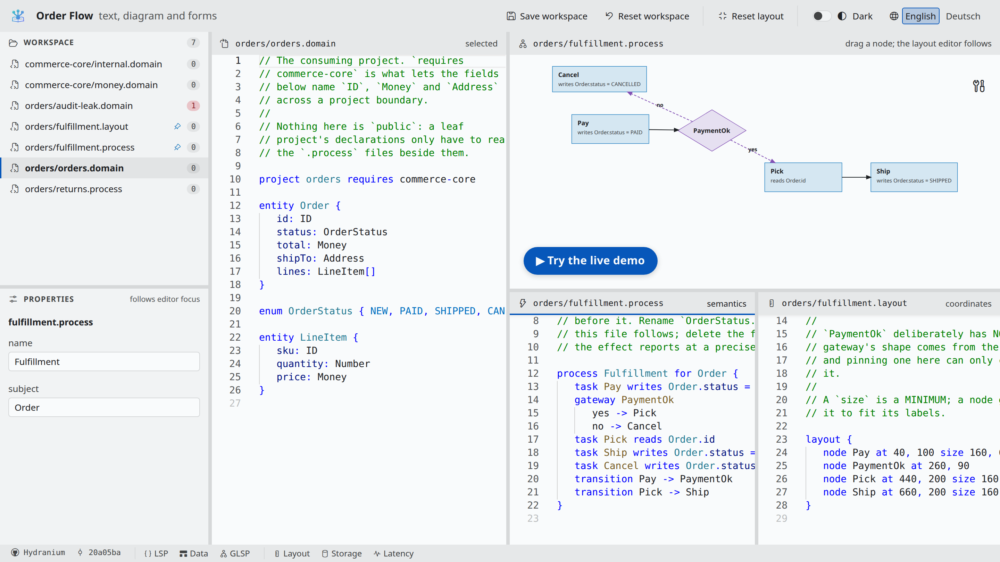
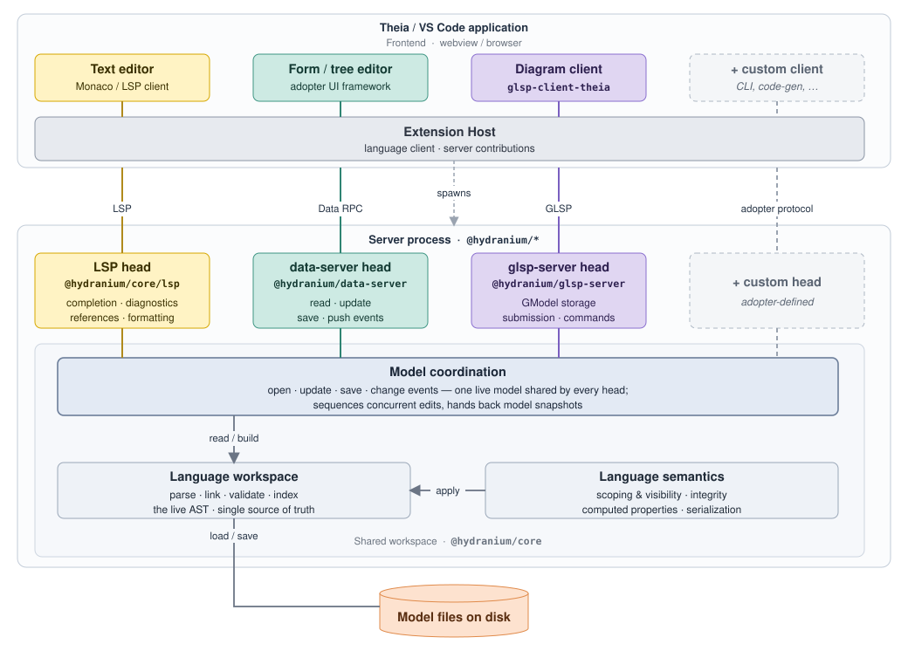

<p align="center">
  <picture>
    <source media="(prefers-color-scheme: dark)" srcset="docs/assets/hydranium-logo-dark.svg">
    
  </picture>
</p>

<h1 align="center">Hydranium</h1>

<p align="center">
  Text, diagrams and forms on one live model, for modeling languages built on
  <a href="https://langium.org/">Langium</a>.
</p>

A modeling language usually gets a text editor, then a diagram, then forms,
each with its own copy of the model and its own code to keep them in sync.

Hydranium gives your Langium language one server that holds the live model and
serves it through one head per protocol: LSP for text, GLSP for diagrams, and a
typed data API for forms, trees and code generators. Any other protocol, such
as MCP for AI agents, is a head of your own beside them. An edit through any
head shows up in all the others, and the model files on disk stay the source of
truth.

<p align="center">
  <a href="https://eclipse-emfcloud.github.io/hydranium/">
    <picture>
      <source media="(prefers-color-scheme: dark)" srcset="docs/assets/demo-dark.png">
      
    </picture>
  </a>
</p>

<p align="center">
  <a href="https://eclipse-emfcloud.github.io/hydranium/"><b>▶ Try the live demo</b></a>,
  in your browser, with nothing to install
</p>

## Why Hydranium

- **One model, many editors.** A text editor, a diagram and a form edit the
  same document at once, and the server coordinates their edits so that none
  silently overwrites another.
- **Files stay the truth.** Models are plain text files in your repository,
  readable in a diff and reviewable like code.
- **Built on Langium.** Your grammar, scoping and validation are ordinary
  Langium. Hydranium adds the heads, the shared workspace and the coordination
  around them.
- **Host it where you need it.** Client libraries for Theia, and example hosts
  for VS Code and the browser. The live demo runs the whole server in a web
  worker, with no backend.

## Architecture

<p align="center">
  <a href="docs/concepts/how-it-works.md">
    
  </a>
</p>

Each editor connects over its own protocol, and every head works on one shared
Langium workspace. [How it works](docs/concepts/how-it-works.md) explains the
layers.

## Start your own

```bash
npx @hydranium/cli init ./my-lang --name MyLang --heads lsp,data,glsp
```

This scaffolds a language server with a starter grammar and a diagram.
`npm run build` and `npm test` work out of the box, and
[Adopting Hydranium](docs/ADOPTING.md) takes it from there.

## Where to go next

- **Building a modeling language?** Start with
  [Adopting Hydranium](docs/ADOPTING.md): getting started, the examples, guides
  and reference.
- **Working on Hydranium itself?** Start with
  [Contributing](docs/CONTRIBUTING.md): setup, conventions, testing and
  releasing.

## Status

Alpha. The API still changes between releases, and every merge to `main`
publishes a prerelease to npm. [Status and limitations](docs/adopting/status.md)
says what that means for you and what is known to be missing.

## License

Licensed under the [MIT License](LICENSE). Third-party copyrights are preserved
in the headers of the files that carry them, and [`NOTICE.md`](NOTICE.md)
records the notices the dependency licences require.

## Trademarks

Eclipse and the Eclipse logo are registered trademarks of the Eclipse
Foundation. GLSP, Theia, Langium, and other product names mentioned herein may
be trademarks of their respective owners.
