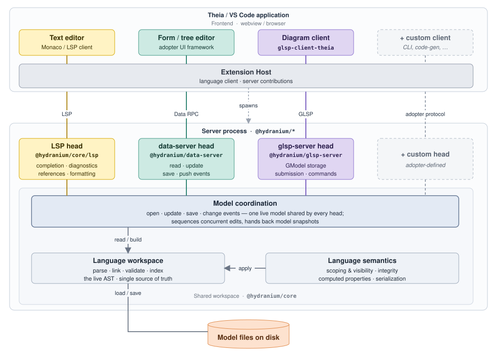

# Architecture Overview

Hydranium is a generic, language-agnostic [Langium](https://langium.org/)-based
framework for building modeling-language servers. Its central idea is **one
shared workspace, several editing heads**: the parsed model — text on disk,
kept live as a Langium AST — is the single source of truth, and multiple
*heads* expose that same AST to different kinds of clients (a text editor, a
form editor, a diagram) without any of them needing their own copy of the
model.

The heads run together in **one server process**. In a Theia or VS Code
deployment that process is a *separate* OS process that the IDE's **extension
host** spawns and connects to — the same model both IDEs use for a language
server — so the heads are not hosted *inside* the extension host; the host holds
only the thin language client and server contributions that bridge the frontend
to the server. Nothing in the framework assumes that topology, though: all
client↔head wires speak
[vscode-jsonrpc](https://www.npmjs.com/package/vscode-jsonrpc)
`MessageConnection` over whatever transport the deployment chooses — stdio, a
socket, IPC, or an in-process duplex pair for tests (where the heads run in the
same process as the client). The framework code is identical in every case;
only the launcher wiring differs. The shared wire types and RPC primitives live
in [`@hydranium/protocol`](../../packages/protocol) so clients can depend on them
without pulling in Langium.

## One workspace, many heads

A single Langium services tree is built once per language and shared by every
head (see the composition example in the [README](../../README.md#compose-a-server--minimal-example)).
Each head is an adapter from a client protocol onto that tree. Three are
provided out of the box:

- the **LSP head** serves Language Server Protocol clients (textual editing);
- the **data-server head** serves a typed JSON-RPC API for non-LSP clients
  (forms, trees, code generators);
- the **glsp-server head** serves graphical clients.

The set is open-ended: a head is just code that holds the shared services tree
and speaks some protocol on a `MessageConnection`, so an adopter can add its own
(a REST bridge, a code-generation endpoint, a bespoke tool protocol) the same
way — the dashed *custom head* in the diagram. They all coordinate through the
shared workspace's **Model coordination** layer (the `AstDocumentManager`), so
an edit made on one surface is observable by the others with no head-to-head
synchronisation protocol.

What the set is open-ended in is *heads*, not *processes*. Heads coexist by
sharing one services tree, and the write serialisation they rely on is
in-process; a second process over the same workspace coordinates with the first
in no way at all. One writer per workspace is therefore a contract — see
[Status: one process writes a workspace](../adopting/status.md#one-process-writes-a-workspace).

The shared workspace itself is layered, as the diagram shows: **Model
coordination** (the multi-client document lifecycle) sits on top of the
**Language workspace** (Langium's live AST — the single source of truth) and
**Language semantics** (the scoping, integrity, computed-property and
serialization services layered onto that AST).

## Textual modeling — the LSP head

Textual editing is provided by an ordinary Langium language server, exposed at
the [`@hydranium/core/lsp`](../../packages/core/src/lsp) subpath and started via
the launcher utilities in [`packages/core/src/launcher`](../../packages/core/src/launcher).
Langium builds the parser, scope provider, linker, validators and completion
from the adopter's grammar; on workspace scan it produces the document store
plus an index of node descriptions used for cross-reference linking and for the
project/scope tiers described below.

A text/Monaco client edits documents over LSP exactly as it would against any
Langium server. What makes Hydranium's LSP head different is that its edits are
routed through the shared workspace's **Model coordination** layer (the
`AstDocumentManager`, below) rather than a private document store, so a co-open
form or diagram editor sees them.

## Typed data access — the data-server head

The LSP protocol is built around textual documents and is awkward for clients
that want the *semantic model* directly — a form editor wants entities and
attributes, not text ranges. The data-server head
([`@hydranium/data-server`](../../packages/data-server/src/data-server.ts),
`DataServer`) closes that gap: it is a typed JSON-RPC service exposing a
`getModelDocument` / `update` / `save` lifecycle plus push notifications
(`onDocumentUpdated`, `onDocumentSaved`, `onProjectsChanged`).

It projects the live Langium AST onto an adopter-supplied transfer shape — there
is no separate EMF runtime model. `new DataServer(connection, shared)`
self-wires its request handlers and outbound notification proxy against the
shared services tree; clients consume it through a typed `createRpcProxy`
(in `@hydranium/protocol`) over the `DataServerProtocol` /
`DataClientProtocol` contracts from `@hydranium/protocol/data`. This head
replaces the
hand-rolled "custom model server + model-service facade + form server" stack
that ad-hoc Langium adopters tend to build.

## Graphical modeling — the glsp-server head

Graphical editing is provided by [`@hydranium/glsp-server`](../../packages/glsp-server),
a generic [GLSP](https://eclipse.dev/glsp/) server framework (storage,
submission, computed-bounds, dispatcher, command stack). Like the other heads
it treats the shared document store as its source of truth: on diagram open it
loads the document, translates the semantic model into a
[GModel](https://eclipse.dev/glsp/documentation/gmodel/), and renders it in the
client widget. User operations on the GModel are translated back into AST
changes through the **Model coordination** layer, the GModel is re-derived, and
any listeners on that document are notified. The Theia-side wiring (connection
handler, dispatcher, diagram widget, module helpers) lives in
[`@hydranium/glsp-client-theia`](../../packages/glsp-client-theia); the cross-head
Output-channel logger lives in
[`@hydranium/client-theia`](../../packages/client-theia).

## Model coordination — the multi-client document lifecycle

The **Model coordination** layer — implemented by the
[`AstDocumentManager`](../../packages/core/src/documents/ast-document-manager.ts) —
is what lets the heads coexist on one document. It generalises the LSP document
lifecycle to a multi-client scenario:

- The first `open` for a URI transfers the file content from the client to the
  server, which then owns the source of truth until the last client `closes`
  it; subsequent opens are no-ops.
- Between open and close, any client may send `update`s. Each update advances
  the document's internal version and records the *author* (which client
  triggered it). The resulting state is forwarded to all co-editing clients
  tagged with that author, so each client can apply or discard it and
  update-cycles are easy to avoid.
- The textual Monaco/LSP client cannot subscribe to that custom listener
  mechanism, so it is updated directly via the LSP
  [`applyEdit`](https://microsoft.github.io/language-server-protocol/specifications/lsp/3.17/specification/#workspace_applyEdit)
  request — the "shadow path"
  ([`LanguageClientTextShadow`](../../packages/core/src/documents/language-client-text-shadow.ts)).
- After the last client closes the document, the in-memory state is dropped.

Updates are currently full-model (the complete model/text is sent and replaces
the complete model/text on the server and in the other clients).

## Language workspace and semantics

Below *Model coordination*, two more layers make up the shared workspace. The
**Language workspace** is Langium's own pipeline — parse · link · validate ·
index — over the live AST, the single source of truth. **Language semantics**
is the set of services `@hydranium/core` layers onto that AST, which an adopter
would otherwise re-implement per language:

- **Project + scope tiers** ([`langium/project`](../../packages/core/src/langium/project),
  [`langium/scope`](../../packages/core/src/langium/scope)) — project-like
  semantics on top of the flat LSP workspace: a directory marked as a project
  forms a closed reference scope that can only see its own elements plus
  explicitly declared dependencies.
- **Integrity-rule registry** ([`langium/integrity`](../../packages/core/src/langium/integrity))
  — cross-document validation and constraint enforcement.
- **AST-extension service** ([`langium/ast-extension`](../../packages/core/src/langium/ast-extension))
  — phase-aware computed properties and synthetic children attached at specific
  Langium document-build phases.
- **Property-ordered YAML serializer** ([`langium/serialization`](../../packages/core/src/langium/serialization))
  — deterministic, human-diffable on-disk form.
- **Transfer-model codegen** ([`@hydranium/cli`](../../packages/cli)) — generates
  the transfer types the data-server head projects onto.

## See also

- [README](../../README.md) — package overview and a minimal end-to-end server.
- [`head-module-maps.md`](head-module-maps.md) — the key
  modules of each head package and how they wire (the module-level companion to
  this overview).
- [`shared-vs-language-di-scope.md`](shared-vs-language-di-scope.md)
  — how the shared vs. per-language DI scopes fit together.
