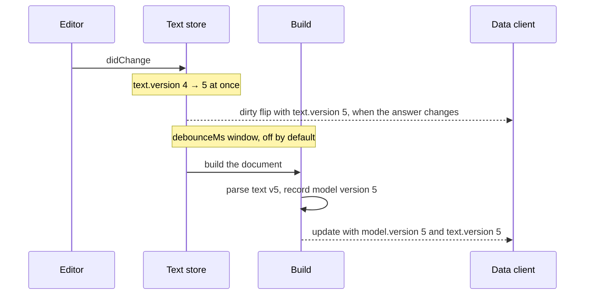

# The four document layers

"Document" means four different things in Hydranium, and mixing them up is the
most common source of wrong reads and lost writes. Each layer answers one
question: what the user typed, what Langium built from it, what the server
hands to your in-process code, and what crosses the wire to a client.

This page tells you which type you are holding, what it carries, and how to
read its versions.

## The layers

| # | Layer | Type | Owned by | Carries |
| --- | --- | --- | --- | --- |
| 1 | LSP text | `TextDocument` | `vscode-languageserver-textdocument` | the characters, plus the text store's version counter |
| 2 | Langium build artifact | `LangiumDocument` | `langium` | the live parse result, CST, references, build state |
| 3 | AST-layer envelope | `AstDocument<TAst, TDiagnostic>` | `@hydranium/core` | the live AST root + the diagnostics and model version read with it |
| 4 | Wire envelope | `TransferDocument<TTransfer, TDiagnostic>` | `@hydranium/protocol` | a `model` (transfer root + diagnostics + version + hash) and a `text` (version + hash + dirty) |

Layers 1 and 2 come from upstream; Hydranium uses them as they are. Layers 3
and 4 are Hydranium's own. They carry the same model, but they are separate
types on purpose, so the compiler stops you from passing one where the other
belongs.

Where your code meets each layer:

- **Langium services** you write, such as a scope provider, work with a
  `LangiumDocument`. Its AST root is `parseResult.value`.
- **`ModelService` reads** in server code return an `AstDocument`.
- **A data client** receives a `TransferDocument` over the wire.
- **A text editor** edits the text that layer 1 holds.

### Layer 1 can lag layer 2's AST

Normally `LangiumDocument.textDocument` holds the exact text its AST was
parsed from. An integrity repair can break that on one path.

When a repair hits a document no client has open, in `'editor'` sync mode it
is staged for the next open instead of being written to disk. Until that open,
`textDocument` can still mirror disk while the AST already carries the repair.

So read a repair from the AST, never from the text:

- Read `parseResult.value`, or an `AstDocument` or `TransferDocument`. All of
  them project the AST.
- Do not read `textDocument.getText()`.

`IntegrityService.SettledState` is the phase after which repairs are in the
AST.

### Layer 3 — `AstDocument`, the live AST with its version

`AstDocument<TAst extends AstNode, TDiagnostic>`
(`core/src/documents/ast-document-manager.ts`) pairs the AST root a build
holds with the diagnostics and the model version read with it. The
`ModelService` reads return it.

- **Do not mutate the root.** It is the build's own `parseResult.value`,
  shared with every reader. A mutation changes what every reader sees without
  a write, so no conflict gate notices it. To change the model, edit a copy or
  a transfer model and write that through a session.
- **`version` and `diagnostics` are as read.** A later build does not move
  them.
- **`diagnostics` is absent until the document is validated**, and `[]` once
  it is validated and nothing was found.
- **Send `version` back as your write's `baseVersion`.** It names the text the
  root was parsed from; see [What a write says it was based
  on](#what-a-write-says-it-was-based-on).

### Layer 4 — `TransferDocument`, the wire envelope

`TransferDocument<TTransfer extends TransferElement, TDiagnostic>`
(`protocol/src/transfer-document.ts`) is `{ uri, model?, text? }`:

- **`model`** is the encoded, frozen form of an `AstDocument`'s model: the
  same version and diagnostics, plus a `hash`. It is absent when the document
  does not exist.
- **`text`** is the server's text state (`version`, `hash`, `dirty`), read
  when the document is sent. It is absent when the server holds no text for
  the document. Its version can be ahead of the model's; see [Comparing the
  two versions](#comparing-the-two-versions).

The root is a `TransferElement`: no `$container` back-references, and
cross-references as strings. That is the shape that can be serialized to
JSON.

## Crossing between them

| Direction | How |
| --- | --- |
| AST → transfer | `TransferEncoder.toTransfer*` (`core/src/langium/transfer/transfer-encoder.ts`) |
| AST or transfer → text | the per-language `Serializer` slot on the language module |
| transfer → AST | serialize to text, then re-parse |

There is no direct transfer-to-AST converter. The parser and linker are the
way back.

## Versions

One counter numbers a document's text: the text store's
(`HydraniumTextDocuments`, carried as `TextDocument.version`). It moves exactly
when the shared text changes and never goes back while the server runs. Every
other version names one value of that counter:

- A **model version** (`ModelVersion`) is the value for the text a model was
  parsed from.
- A **text version** (`TextVersion`) is the value for the text the server
  holds now.

### Reading a transfer document

A document the data head sends between an edit and its build:

```jsonc
{
   "uri": "file:///workspace/a.x",
   "model": {
      "root": { "$type": "…" },
      "diagnostics": [], // absent until the document is validated
      "version": 4,
      "hash": "…"
   },
   "text": { "version": 5, "hash": "…", "dirty": true }
}
```

- **Write against `model.version`.** A write's `baseVersion` is the
  `model.version` of the model it edits, 4 here. `text.version` is a
  `TextVersion` and does not compile in that field.
- **Render on `model.hash`.** It fingerprints the model sent and never its
  version, so an update with an unchanged `model.hash` has nothing new to draw.
- **Dirty state is `text.dirty`**, read when the document is sent. A watcher
  learns of later changes through `onDocumentDirtyChanged`.
- **`model.version` below `text.version`** means the text moved and its build
  has not parsed it yet. A watcher is sent an update at version 5 or later. A
  write based on 4 conflicts meanwhile, since the gate compares it with 5.
- **`text` can be absent**, when the server holds no text for the document. A
  dirty flip's `text` is absent when the document no longer exists.

### One edit, version by version



Between the edit and the parse, the model is behind its text: a document sent
then carries `model.version` 4 with `text.version` 5. Once the build has
parsed, `model.version === text.version` again.

A session write moves the same counter. The gate checks its `baseVersion`
against `text.version`, the store applies the text (5 → 6), and the session
rebuilds before it answers. The answer carries version 6 in both blocks unless
another edit landed meanwhile.

### Comparing the two versions

A transfer document carries both versions. How they compare tells you whether
the model is current:

| Comparison | Means | What follows |
| --- | --- | --- |
| `model.version === text.version` | in sync: the model was parsed from the text the server holds | nothing |
| `model.version < text.version` | behind: the text moved and its build has not parsed it yet | a watcher is sent an update at `text.version` or later; a reader takes it or reads again. A write based on `model.version` conflicts, and its writer reconciles |
| `model.version > text.version` | never, within one server lifetime | — |

The text moves first, at the edit; the model moves when a build parses that
text. The data head sends a watcher every new model version. When only the
text moved (whitespace, a comment the encoder drops), the update keeps the
same `model.hash`. So a client that skips a render on an equal `model.hash`
still learns the new version.

`>` cannot happen, because a model version is a value the counter already had
and the counter never goes back. A restarted server numbers afresh, so a
version from before the restart identifies nothing. Compare `text.hash` across
a restart, as `DataSession`'s restore does.

### Waiting for a current model

Every `ModelService` wait resolves once the document reaches the state with a
root parsed from text no older than the store's version when you called. A
later edit does not extend that target. Pick a read by what you want to happen
until then:

- **`snapshot(uri)`** does not wait. It returns the `AstDocument` as it stands,
  or `undefined` for a missing document or one the builder has not parsed
  yet.
- **`ensureDocumentState(uri, state?)`**, and the phase shortcuts `parsed`,
  `linked`, `settled`, `indexed` and `validated`, build a missing document or
  one behind its text, then wait. The default state is
  `IntegrityService.SettledState`. When the build keeps failing, they reject
  with an error naming the document and the state.
- **`waitForDocumentState(uri, state)`** and **`waitForDocumentSettled(uri)`**
  only wait. They reject for a missing document, and otherwise wait for
  another build or their cancellation token.

Diagnostics come only from the `Validated` state. If you need them, call
`validated(uri)`.

Two rules for where you wait:

- **Never await a wait inside a build phase listener or a
  `WorkspaceLock.read`.** It waits for a build that cannot start until your
  code returns.
- **Inside a build's write-lock scope on a Node host**, a wait checks the state
  alone, since a syncing build cannot start there. `ensureDocumentState` on a
  missing document then rejects with `ReentrantWriteLockError` unless
  `ModelServiceOptions.allowReentrantBuilds` is set.

## What a write says it was based on

A write's `baseVersion` is the version its read returned: the model version of
the model you edited. That holds for both write styles:

- **Snapshot-diff:** you project the model, edit the projection and write the
  result. Declare the version the projection carried.
- **Read-then-write:** you read the document, author a change from it and
  write it. Declare the version that read returned.

The gate compares `baseVersion` with the store's version when the text is
applied. If they are equal, the write applies. Otherwise it fails with a
`ConflictError` naming both, and applies nothing. `'any'` skips the gate and
overwrites whatever the server holds.

The field's type is `BaseVersion`, which is `ModelVersion | 'any'`, and it is
required. Only reads hand out a `ModelVersion`, so the version a read returned
fits the field as is:

<!-- snippet-skip: contrasting fragments shown outside any enclosing method -->

```ts
// Right: the version is the one the read returned, next to the read.
const snapshot = await modelService.validated(uri);
await session.save({ uri, model: edited(snapshot.root), baseVersion: snapshot.version });

// Explicitly ungated, for a write with no reader behind it.
await session.save({ uri, model, baseVersion: 'any' });
```

`document.textDocument.version` and `text.version` do not compile in that
field. Both name the text the server holds now, which can be newer than the
model you edited, and the write would silently overwrite the newer text.
`asModelVersion` forces a number through if you really need to.

A gate that never fires looks like a gate that found no conflict. Test yours
by advancing the document between the read and the write and asserting a
`ConflictError`, not by checking that ordinary writes succeed.

## A transfer write preserves comments, but not layout

A form or diagram edit reaches the server as a transfer model. The only way
back to text is the serializer, which emits the whole document. So **the file
is rewritten, not patched**, and most lines come back in the serializer's
layout.

What survives:

- **Comments and the trailing whitespace.** The `trivia` preservers carry them
  over from the document being overwritten. They are registered per language
  by default; an empty registry switches preservation off.
- **Only comments tied to exactly one node.** A comment is dropped when its
  node has no identity from the `NameProvider`, when two siblings share one,
  or when the write deleted the node. Reordering a list can drop its members'
  comments.
- **A comment follows its node's name.** If one write renames a node and gives
  the old name to another node, the comment lands on the other node.

To give the preserver the right identity:

- Point `NameProviderOptions.nameProperties` at the real identifier wherever
  `name` is only a display label.
- For nodes identified outside the naming surface, override `anchorKey` on
  `CommentPreserver`, as `OrderFlowCommentPreserver` in the order-flow example
  does. Those comments are not carried across a rename.

**Tell your users.** Two consequences you decide about rather than let them
discover:

- Layout is transient even though comments are not. If your language's users
  hand-format their files, a form or diagram write normalises that formatting.
- A text editor and a form editor over the same file is still supported. The
  LSP head mirrors the rewritten text straight back into the open editor, but
  the diff a user sees after one field edit spans the file.

To normalise layout on demand instead, bind Langium's `lsp.Formatter` slot for
`textDocument/formatting`.

## Where an adopter's alias belongs

You will usually want your own names rather than repeating the generics. Both
envelopes are plain generic interfaces, so an alias is all you need:

```ts
type MyAstDocument = AstDocument<MyRoot, MyAstDiagnostic>;
type MyTransferDocument = TransferDocument<MyTransferRoot, MyTransferDiagnostic>;
```

Three rules keep aliases from mixing the layers up again:

1. **Alias each layer separately.** One alias covering "the document" pushes
   the AST-or-transfer decision back to every call site.
2. **Keep the layer in the name.** An alias called `MyDocument` reads as
   whichever layer the reader last had in mind.
3. **Give each layer its own diagnostic type.** `AstDocument` carries an
   `AstDiagnostic`, which is an LSP `Diagnostic`. `TransferDocument` carries
   what `TransferEncoder.toTransferDiagnostic` produced. They share no field
   types: `severity` is LSP's numeric enum on one and a string union on the
   other. `AstDocument`'s constraint rejects one alias for both.

For the rationale behind the two envelopes and the version machinery, see
[Document layers: design](../contributing/design/document-layers.md).
