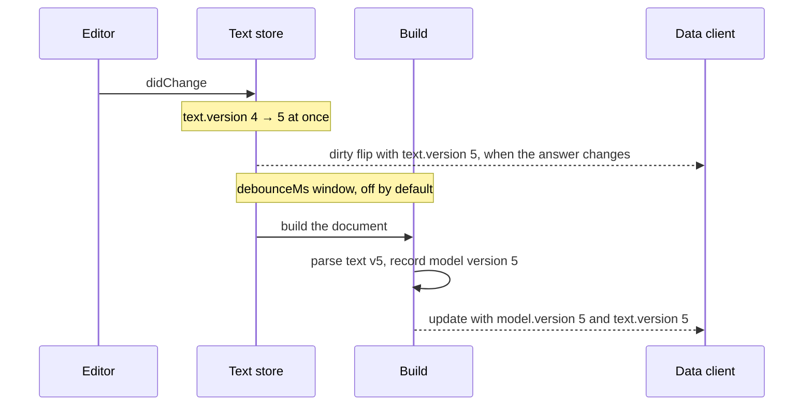

# The four document layers

A "document" means four different things in this framework, and they are
routinely confused — the confusion is what this doc exists to remove. Each
layer owns a different question: what the user typed, what Langium built from
it, what the server hands to in-process consumers, and what crosses the wire.

**How to read it.** The layers are listed outermost-in: bytes first, wire
shape last. The two the framework itself owns — `AstDocument` and
`TransferDocument` — carry the same model, live in the first and encoded in
the second's `model` block, and are deliberately NOT the same type; the
section after the table explains why, because that is the decision people try
to undo.

## The layers

| # | Layer | Type | Owned by | Carries |
| --- | --- | --- | --- | --- |
| 1 | LSP text | `TextDocument` | `vscode-languageserver-textdocument` | the characters, plus the text store's version counter |
| 2 | Langium build artifact | `LangiumDocument` | `langium` | the live parse result, CST, references, build state |
| 3 | AST-layer envelope | `AstDocument<TAst, TDiagnostic>` | `@hydranium/core` | the live AST root + the diagnostics and model version read with it |
| 4 | Wire envelope | `TransferDocument<TTransfer, TDiagnostic>` | `@hydranium/protocol` | a `model` (transfer root + diagnostics + version + hash) and a `text` (version + hash + dirty) |

Layers 1 and 2 are upstream: the framework consumes them and does not
redefine them. Layers 3 and 4 are the framework's own, and are where the
naming questions arise. Every layer carries a version, and they all count
one thing; [Versions](#versions) says what each identifies.

### Layer 1 can lag layer 2's AST

The two upstream layers are normally in step — `LangiumDocument.textDocument`
is the characters its AST was parsed from. An integrity repair breaks that on
one path, and it is worth knowing before you read a repair back.

A rule mutates the AST in place; the integrity tier then serialises the result
and routes it by how the document is held. It commits the repair into the
shared text store only if the store still contains the text that produced the
AST, then reconciles the registered Langium document by re-parsing or
re-linking. What happens next depends on whether any client holds the URI.
Open in an editor, the settled listener sends it the corrected content as a
`workspace/applyEdit`. Held only through the data or GLSP head, the repair
stays in the store, where those heads read it. In `'silent'` sync mode it also
goes to disk when disk still holds the text the repair was computed from and
the store still holds the repair, the repair then being the only difference.
Otherwise — the holder has unsaved edits, disk changed behind the server, or
disk cannot be read — the repair reaches disk with the next save. Those heads
mark only their own edits unsaved, so without that write a repair of text they
never changed would leave store and disk apart with nothing showing it. Closed
in every client, the repair goes to disk in `'silent'` sync mode, or to a
staging slot in `'editor'` mode. A staged repair is the exception:
Langium's factory may skip re-parsing because the CST's `fullText` still
equals the disk text it re-reads, leaving the mutated AST ahead of the text
document until a first open consumes the stage.

So for a closed document with a staged repair, layer 1 mirrors **disk** while
layer 2's AST carries the repair. `IntegrityService.SettledState` is the
landmark for post-integrity content, and what it guarantees is the AST: read a
repair from `parseResult.value`, or from the staged content, never from
`textDocument.getText()`. Layers 3 and 4 both project the AST, so both carry
the repair — only a consumer reading the raw text sees the older state.

### Which text wins during a build

The shared text store is `HydraniumTextDocuments`; it is keyed by canonical
URI. Its *server-owned* content version is distinct from the version an LSP
client declares for its own buffer; [Every version and
hash](#every-version-and-hash) lists both. A language-client shadow records the
client-facing URI and the buffer used to calculate an outbound edit. The shadow
is delivery state, not another source for parsing.

The build-side descriptions below apply after a successful
`IntegrityService.SettledState` phase. Client delivery may finish later.

| URI state | Text authority and writer | Registered Langium document at settle | Editor shadow and delivery |
| --- | --- | --- | --- |
| Closed file, no staged repair | Disk; a closed `'silent'` repair writes it. | A build reads disk and reconciles after a textual repair. There is no open store entry. | None. |
| Open in the language client | Shared store; `didChange`, server-authored updates, and current-source integrity repairs write it. Disk is not written under the open editor. | A textual repair commits by URI and reconciles text/CST with the store; the AST also has its derived state. | Based on the editor's declared buffer. The settled listener queues a shadow-based `workspace/applyEdit`. |
| Open only through data or GLSP | Shared store; session updates and current-source repairs write it. `save` persists it, and so does a `'silent'` repair whose source text is what disk holds. | A textual repair commits by URI and reconciles against store text. In `'silent'` mode it writes disk only when disk holds the text it was computed from, so unsaved updates never ride along. In `'editor'` mode it never writes disk, and the repair leaves the document dirty until a save. It never stages, since an editor attaching joins the existing entry instead of taking the first-open path that reads a stage. A last close without a save discards a repair left in the store along with the unsaved updates; the disk-backed rebuild the store runs next, for every head, sees a closed file, so a defect still on disk takes the closed-file route. A document whose last close came from a lost connection and that waits out the release grace is treated as open here, so its unsaved text reaches no disk. | None until an editor attaches; an editor joining this existing store refreshes from its current content. |
| Separately constructed Langium document for an already-open URI | Existing shared store; the separate document is not a text authority. | Its AST can enter a build, but repair commits only if its CST source still matches the store. A stale mutation is abandoned and the registered document is reconciled from current text. | Follows the actual open holder, never the separate document's text object. |
| Closed file with an `'editor'`-mode staged repair | Disk remains persisted; pending content takes priority on the next first open. | The settled AST carries the repair, while `textDocument` and CST may still describe disk. | None while closed. First `didOpen` starts a shadow from the editor's declared buffer so the pending correction can be delivered. |

The transitions that change the owner are explicit:

- **First `didOpen`** creates the shared entry from pending content, if any,
  otherwise from the client's declared text. An editor shadow starts from the
  text the editor actually declared. If another client already holds the URI,
  the editor attaches to that entry and refreshes from its current content.
  A first open of a document a build already parsed continues the numbering:
  the version of the text last built when the opening text is that text, the
  next version when it differs. Numbered from the
  opener alone, a write based on that root could pass the gate over different
  text. A URI with no history, never built or held only by the builder's
  placeholder, starts at the opening client's declared version and continues
  the shared sequence from then on, as does one whose root records
  `STALE_VERSION`.
- **`didChange` or a data/GLSP update** changes shared text and drives a build.
  LSP versions gate only that client's incoming packets; the server's content
  sequence advances only when shared text changes. A server-authored update
  checks its `baseVersion` before installing a payload.
- **Integrity repair** compares the AST's parsed source with the current open
  store before committing. A stale repair cannot overwrite a newer edit, and
  reconciliation discards its obsolete AST mutation. A repair for a URI some
  client holds stays in the store, and in `'silent'` mode also reaches disk
  when disk holds the text it was computed from; one for a URI no client holds
  follows the disk or staging route in the table.
- **Outbound `workspace/applyEdit`** uses the client's shadow and declared
  version, not the server's content version. The build can settle while this
  request is still in flight, so settlement alone does not prove the visible
  editor has applied the edit. A rejected edit invalidates the shadow for a
  position-independent retry.
- **Save and last close** are separate transitions. `save` takes the current
  store text and writes it through the file's disk queue, in the order saves
  were called. The last close removes the shared entry and editor shadow and
  retains the content-version sequence. The document is then rebuilt from the
  file system provider by the text store, for every head, once its disk queue
  has drained, and a reopen reads the file in that queue, after any save still
  writing. A document the provider cannot serve, of any scheme, is removed
  from the index instead (see [Last close and release](../contributing/design/client-sessions.md#last-close-and-release)).

The open-document repair tests in the order-flow example exercise the normal
and separately constructed paths in both sync modes, for a URI an editor
holds, and the row for a URI held only through the data head, in both sync
modes: an unsaved update's repair across a save, and a repair of a defect the
head found on disk. The order-flow GLSP suite holds a URI through an open
diagram alone and checks that the repair of an unsaved write stays off disk.

### Layer 3 — `AstDocument`, the live AST with its version

`AstDocument<TAst extends AstNode, TDiagnostic>`
(`core/src/documents/ast-document-manager.ts`) pairs the AST root a build holds
with the diagnostics and the model version read with it. Its manager is
`AstDocumentManager`, and the `ModelService` reads return it.

**The root is live, not a copy.** It is the build's own
`parseResult.value`, shared with every reader: a relink resolves its
references again in place, and a reparse replaces it. It must not be mutated.
A mutation changes the model every reader sees without a write, so no
conflict gate hears of it. A writer edits a copy or a transfer model and writes
that through a session.

`version` and `diagnostics` are as read: a later build does not move them.
`diagnostics` is absent until the document is validated, and `[]` once it is
and nothing was found. `snapshot` below `Validated` and the phase reads
`parsed` to `indexed` leave it absent even when an earlier build's diagnostics
exist, since those may describe text the document no longer has.

The version is load-bearing rather than informational: an in-process caller
sends it straight back as the `baseVersion` of its write
(`ClientSessionWriteArgs.baseVersion`) to arm the conflict gate. Its type is
`ModelVersion`, recorded when the document factory parsed the root, so it
names the text the root came from even after the store has moved on. An
integrity repair moves the store's counter like any edit, so a read taken
before a repair is stale rather than merely older.

### Layer 4 — `TransferDocument`, the wire envelope

`TransferDocument<TTransfer extends TransferElement, TDiagnostic>`
(`protocol/src/transfer-document.ts`) is `{ uri, model?, text? }`, two blocks
that are each absent where the server has nothing to put in them:

| Block | Type | Fields | Absent when |
| --- | --- | --- | --- |
| `model` | `TransferModelSnapshot` | `root`, `diagnostics?`, `version`, `hash` | the document does not exist (`TransferDocument.absent`) |
| `text` | `TextState` | `version`, `hash`, `dirty` | the server holds no text for the document |

`model` is the encoded, frozen form of an `AstDocument`'s model: the same
version and diagnostics, the root encoded once. `text` is read when the
document is sent, so its version can be ahead of the model's; see [Comparing
the two versions](#comparing-the-two-versions).

The root's type is the difference between the layers. `TransferElement` is
the **transfer** shape — no `$container` back-references, cross-references as
strings — because an AST root cannot be serialized to JSON: its containment
links are cyclic and its `Reference<T>` objects are resolution machinery, not
data.

Its paired events are `TransferDocumentUpdatedEvent` /
`TransferDocumentSavedEvent` (`protocol/src/data/events.ts`), mirroring the
AST layer's `AstDocumentUpdatedEvent` / `AstDocumentSavedEvent`.

## Why 3 and 4 are not one type

`AstDocument` and `TransferDocument.model` carry the same model: `version`,
`root`, `diagnostics`. Collapsing them into a single
`ModelDocument<TRoot, TDiagnostic>` was **proposed and rejected** (locked
2026-05-12).

The reason is that the generic constraint is the entire point. `TAst extends
AstNode` and `TTransfer extends TransferElement` are what stop an AST root
from being handed to a wire method, and a transfer root from being handed to
something expecting resolvable references. A shared umbrella type would have
to relax to the union of both, and the two roots are exactly what must never
be confused — they differ in cyclicity and in whether references are resolved.

So the duplication is deliberate: **the pair surfaces the AST-vs-transfer
distinction at every declaration site**, which is where an author would
otherwise reach for the wrong one.

## Crossing between them

The translation is **one-directional by design**.

| Direction | Mechanism |
| --- | --- |
| AST → transfer (structure) | `TransferEncoder.toTransfer*` (`core/src/langium/transfer/transfer-encoder.ts`) |
| AST or transfer → text | the per-language `Serializer` slot on the language module |
| transfer → AST | *no direct converter* — serialize to text, then re-parse |

There is no `decode` method, and the absence is intentional rather than
unimplemented. Going backwards means restoring `$container` links and
resolving every reference against a scope — which is what the parser and the
linker already do. **The parser is the decoder.** A direct transfer→AST
converter would be a second, weaker implementation of scope resolution.

The asymmetry follows from transfer being lossy with respect to `$container`,
`$cstNode` and `Reference<T>` resolution.

## The two transfer modes, and why `'grammar'` is the one you diff

`TransferEncoder.toTransfer` emits one of two shapes, and the choice is a
correctness decision rather than a filter.

| Mode | Contains | For |
| --- | --- | --- |
| `'full'` (default) | every own property, including computed scalars and synthetic child mirrors | the wire shape clients consume |
| `'grammar'` | only the grammar-declared properties, each carrying the node's own authored value | the base a write diffs and a serializer round-trips |

**`'grammar'` is defined by what it guarantees, not by what it omits.** It is the
*authored state* — what the document actually declares — which is what makes it
safe to diff two of them and persist the result. Two mechanisms deliver that, and
both matter: the key set comes from the reflection allowlist, so no computed
*key* appears; and the walk reads each value straight off the node rather than
through the `resolvePropertyValue` hook, so no computed *value* appears under a
declared key either.

That second half is the one worth knowing about if you extend the encoder.
`resolvePropertyValue` exists to substitute derived values — an
inheritance-resolved field, a preference-dependent label — and it is called in
`'full'` mode only. An override that also applied to `'grammar'` would leave that
shape diffable and acyclic but no longer authored, and the two consequences are
both silent: a property inherited from elsewhere diffs as a local edit whenever
its source moves, and a forward-write reconcile measures the user's intent
against a base the document never contained. The framework scopes the hook
for you; the thing to remember is *why* it is scoped, because the same reasoning
applies to any extension that reaches the grammar shape.

## Versions

One counter numbers a document's text: the text store's
(`HydraniumTextDocuments`, carried as `TextDocument.version`). It moves exactly
when the shared text changes, never goes back within one server lifetime, and
is kept across a close and a reopen. It counts every document a build parsed,
opened or not, and survives the file's deletion, so neither an external change
of a never-opened file nor a recreated file reuses a version handed out for
other text. Every other version names one value of it at a particular moment:
a **model version** (`ModelVersion`) is the value of the text a model was
parsed from, a **text version** (`TextVersion`) the value of the text the
server holds now.

Three services keep the two sides apart. The text store is the text side: the
counter, the open text, and each URI's `TextState` (version, hash, dirty). The
`ModelLedger` is the model side: each root's `ModelVersion`, the text it was
parsed from where the CST no longer holds that text, and which root is the
builder's placeholder. The `VersionSyncService` reconciles every model a
producer reports with the store, decides whether a model is behind its text,
and owns every recovery build: `requestRecoveryBuild` and `syncTo` retry a failed
build once, then give up.

### Reading a transfer document

A document the data head sends between an edit and its build:

```jsonc
{
   "uri": "file:///workspace/a.x",
   "model": {
      "root": { "$type": "…" },
      "diagnostics": [], // absent until the document is validated
      "version": 4,
      "hash": "…"
   },
   "text": { "version": 5, "hash": "…", "dirty": true }
}
```

- **Write against `model.version`.** A write's `baseVersion` is the
  `model.version` of the model it edits, 4 here. `text.version` is a
  `TextVersion` and does not compile in that field.
- **Render on `model.hash`.** It fingerprints the model sent and never its
  version, so an update with an unchanged `model.hash` has nothing new to draw.
- **Dirty state is `text.dirty`**, read when the document is sent. A watcher
  learns of later changes through `onDocumentDirtyChanged`.
- **`model.version` below `text.version`** means the text moved and its build
  has not parsed it yet. A watcher is sent an update at version 5 or later. A
  write based on 4 conflicts meanwhile, since the gate compares it with 5.
- **`text` can be absent**, when the server holds no text for the document. A
  dirty flip's `text` is absent when the document no longer exists.

### One edit, version by version



Between the edit and the parse, the model is behind its text: a document sent
then carries `model.version` 4 with `text.version` 5. Once the build has parsed,
`model.version === text.version` again. A session write moves the same counter:
the gate checks its `baseVersion` against `text.version`, the store applies the
text (5 → 6), and the session rebuilds before it answers, so the answer
carries version 6 in both blocks unless another edit landed meanwhile.

### Comparing the two versions

A transfer document carries both moments, and how they compare is the whole
answer to "is this model current?":

| Comparison | Means | What follows |
| --- | --- | --- |
| `model.version === text.version` | in sync: the model was parsed from the text the server holds | nothing |
| `model.version < text.version` | behind: the text moved and its build has not parsed it yet | a watcher is sent an update at `text.version` or later; a reader takes it or reads again. A write based on `model.version` conflicts, and its writer reconciles |
| `model.version > text.version` | never, within one server lifetime | — |

The text moves first, at the edit; the model moves when a build parses that
text. The data head sends a watcher every new model version, with an unchanged
`model.hash` when only the text moved (whitespace, a comment the encoder
drops), so a client that skips a render on an equal `model.hash` still learns
its version. `>` cannot happen because a model version is a value the counter
already had and the counter never goes back. A restarted server numbers afresh,
so a version from before the restart identifies nothing; compare `text.hash`
across a restart, as `DataSession`'s restore does.

### Waiting for a current model

A `ModelService` wait resolves **synced to the text version of the call**: the
document has reached the state, with a root parsed from text no older than the store's version when the
call was made. The reads differ in what they do until then:

| API | Document missing | Can initiate a build? | Returns |
| --- | --- | --- | --- |
| `snapshot(uri)` | `undefined`, as for the builder's placeholder | no, and it does not wait | the `AstDocument` as it stands; diagnostics only from `Validated` |
| `waitForDocumentState(uri, state)` | rejects | only a re-queue of a document the builder's last build left short of `state`; a root behind its text waits for another build | the `AstDocument` at `state` or above; diagnostics only when `state` is `Validated` |
| `waitForDocumentSettled(uri)` | rejects | as `waitForDocumentState` | the `AstDocument` at `IntegrityService.SettledState` or above, without diagnostics |
| `ensureDocumentState(uri, state?)` | builds it through `rebuild`, and rejects when that build leaves no document | yes: the re-queue, and `VersionSyncService.syncTo` for a root behind its text | the `AstDocument` at `state`, by default `IntegrityService.SettledState`, or above; diagnostics only when `state` is `Validated` |
| `parsed` / `linked` / `settled` / `indexed` / `validated` | as `ensureDocumentState` | as `ensureDocumentState` | as `ensureDocumentState` at that phase; diagnostics only from `validated` |

Every wait in the table shares these exceptions:

- **Inside a tracked write-lock scope, the state alone.** The build that would
  sync the document cannot start until the lock is released. On a Node
  host the scope follows the async stack (`AsyncLocalStorage`), so a build's
  phase and `onUpdate` listeners, and async work they start, even work that
  outlives the build, wait for the state only. There, `ensureDocumentState`
  on a missing document rejects with `ReentrantWriteLockError` unless
  `ModelServiceOptions.allowReentrantBuilds` is set.
- **A root with no recorded version counts as synced**, since no build
  would ever record it.
- **A later edit does not extend a call's target**: the store's version is read
  when the call is made.
- **Never await one inside a build phase listener or a `WorkspaceLock.read`.**
  A browser host installs no write-lock scope, so inside a listener the wait
  cannot tell it is inside a build, and waits for one that cannot start.
  Langium's lock starts no write while a read runs, so inside a read the build
  waits for the read that waits for it.
- **For `ensureDocumentState` and the phase shortcuts, recovery that keeps
  failing rejects.** A failed sync or re-queued build is retried once;
  when the retry fails too, or the builder stops re-queuing a document its
  builds do not advance, the call rejects with an error naming the document
  and the state rather than waiting for a build that is not coming. This
  holds until the state is reached, so a build that fails after the parse
  rejects the call too. `waitForDocumentState` and `waitForDocumentSettled`
  keep waiting instead, for another build or their cancellation token.

### Every version and hash

| Name | Type | Stamped by | When | Identifies |
| --- | --- | --- | --- | --- |
| LSP client version id | `number` | the editor | on its `didOpen` / `didChange` | that editor's own buffer. Gates only that client's own packets, against its previous id, and is the version an outbound `workspace/applyEdit` names |
| Shared counter (`TextDocument.version`), `TextVersion` | `number` | `HydraniumTextDocuments` | on each change of the shared text: an edit, a session write, an integrity repair, a build that reads different file text while no client holds the document (a revert, a watched-file change, a recreated file) | the text the server holds |
| `ModelVersion` | branded `number` | the root's producer, reported to `VersionSyncService.modelProduced` and recorded in the `ModelLedger` | when a root is parsed or created, from the store's version read before the parse | the text the root was parsed from. `UNRECORDED_VERSION` (`-2`) for a root no producer reported; `STALE_VERSION` (`-1`) for a root parsed from the file while the store held the document open with other text, which reads as behind until the build it requests |
| `AstDocument.version`, `model.version` | `ModelVersion` | the envelope constructors, from the root's `ModelLedger` record | when the envelope is made | as `ModelVersion` |
| `text.version` | `TextVersion` | the data head, from `TextDocuments.textState(uri)`, or from the built document for a text the store never held | when the document is sent | the text the server held as it sent it |
| `baseVersion` (write field) | `BaseVersion` = `ModelVersion \| 'any'` | the writer | per write | the text the write was authored against; `'any'` writes ungated |
| `ConflictError.baseVersion` / `.actualVersion` | `ModelVersion` / `TextVersion` | the session's gate | when it refuses a write | the write's base, and the text the gate found instead |
| Dirty flip `text.version` | `TextVersion` | the text store | when `isDirty` changes; for an edit, before its build | the text the answer was decided on. Absent when the document no longer exists, or after a release whose follow-up build failed (see [Dirty state](../contributing/design/client-sessions.md#dirty-state)) |
| GLSP `baseVersion` / `baseVersionOf(uri)` | `ModelVersion` | the GLSP state: the source root's `ModelLedger.versionOf` in `captureSourceRoot`; a secondary document's `ModelLedger.versionOf` of the built root an operation copies it from | when the source root is read; for a secondary document, at `trackSecondaryDocument` (during an operation, the root the operation first reached) and each `captureSourceRoot` | the text the diagram's projection came from; `UNRECORDED_VERSION` for a document with no parsed root, so a write based on it conflicts; a secondary created through `createSecondaryDocument` takes the version the create gave it. A merged retry is gated on its refetch's `VersionedModel.baseVersion`, the store's version read in the tick its text is |
| `text.hash` | `string` | the text store (once per version), or the data head for a text the store never held | when the document is sent | the text content alone, not its version or dirty state, so equal across a revert and a server restart |
| `model.hash` | `string` | the data head's fingerprint | when the document is sent | the snapshot sent, never live state: its `root` + `diagnostics` (absent hashes apart from `[]`), or under the `'text-diagnostics'` strategy the text that root was parsed from + `diagnostics`. Never the version |

### Replacing the factory, registry, integrity or residency service

A replacement has one obligation: report every model it produces to
`VersionSyncService.modelProduced(document, origin)`. A factory passes
`origin.version`, the store's version read before the parse; a producer whose
CST does not hold the text the model describes, such as an in-place repair,
passes that text as `origin.text`; a registry reports each document it
registers, with no `origin`. A residency service that sheds a CST produces no
model: it records the root's text with `ModelLedger.record`, at the root's
recorded version, before shedding.

A model nobody reported reads `UNRECORDED_VERSION`. Waits count it as
synced, so a read of it loses its freshness guarantee, and every write gated on
its version conflicts, since no text version matches it. The warning `No model
version recorded for the root: it was built outside the document factory`,
which `AstDocumentManager.toAstDocument` logs when it projects such a root,
means some producer made that root without reporting it; the builder's
placeholder is exempt.

### Lifecycle mechanics

**Registration and re-parse.** A workspace root gets its model version in one
of two places: when a load registers it, and when a build re-parses it (the
document factory's `update`). A cancel can skip neither. Both report it to
`modelProduced`, which reconciles it with the store, so a root records the
store's version exactly when it was parsed from the store's text at that
version, and then fires `onDidRecordModel`. A root parsed from other text, the
file read while a client opened the document with text of its own, records
less than the store's version (`STALE_VERSION`, or the version read before the
parse). `modelProduced` and a session's first open hand such a root to
`syncTo`.

**Placeholders.** The builder's placeholder for a file it has not parsed yet
is not handed out as a document: `snapshot` answers `undefined` and the data
head an envelope with no model. `modelProduced` marks the root of any document
registered below `Parsed` as one (`ModelLedger.isPlaceholder`), and that root
records no version, so a write based on a projection of it conflicts. A
rebuilt document is reset to `Changed` too, but keeps its root and that root's
version until the parse replaces it, and is handed out.

**Integrity repairs and residency.** An integrity repair of a document no
client has open reports the root with the repaired text, which the CST does
not hold when the factory skipped the re-parse; the root then records the
store's version of the repair, and `ModelLedger.textOf` answers that text.
Shedding a CST records the root's text in the ledger directly rather than
through `modelProduced`: no root is produced, and reconciling would step a
closed document's sequence for a root behind its text.

**Scheduling.** `syncTo` requests a build from a `WorkspaceLock` read, so the
build queues behind the running one rather than cancelling it, starts once no
write runs or is queued, and is skipped if the root is no longer behind then.
Requests for a URI whose build is pending share its next build. A change the
update handler still debounces (`registerDeferredBuilds`) is left to the
debounce's build, which serves the wait, so the change is built once. A
re-queue ignores the debounce, answering a waiting caller sooner at the cost
of a possible duplicate build, and stops after a bounded number of builds that
do not advance the document: a syncing read (`ensureDocumentState` and the
phase shortcuts) then rejects, and any other wait is left to its cancellation
token. A syncing read on a document a failed
build left short of its state re-queues it even with no build to end.

**Cancellation and retry.** A wait behind its text wakes on `onDidRecordModel`
for the document, or its deletion, and then waits for the state again: a
`Parsed` phase listener would be skipped by a cancel right after the parse,
and the resumed build does not parse again. A request whose build a later
write cancelled rides the next build, and the cancel does not count as a
failure. Each request is retried once after a failed build, also when it
joined the batch late; when its retry fails too, `requestRecoveryBuild` resolves
`false` for that request alone, and a syncing read waiting on it, as its
sync build or as its re-queue, rejects.

## What a write says it was based on

A base version is only meaningful relative to the moment the content was
read. Two write styles are in play, and they read at different moments:

- **Snapshot-diff** — project the model, edit the projection, write the result.
  The version to declare is the one the projection carried, because that is the
  state the edit is expressed against. `ReconcilingMultiDocumentGlspState` works
  this way: it takes a base at `captureSourceRoot` and diffs against it.
- **Read-then-write** — read the document, author the change from what the read
  returned, write it. The version to declare is the one that read returned,
  because that is the content the change assumed.

The rule for both: **a write's `baseVersion` is the version its read
returned**, which is the model version of the model it edited. The gate
compares it with the store's version when the text is applied: equal, the
write applies; anything else, the write fails with a `ConflictError` naming
both, and applies nothing. `'any'` skips the gate and overwrites whatever the
server holds. The field enforces the rule in two steps.

Its type is `BaseVersion`, `ModelVersion | 'any'`. `ModelVersion` is a
`number`, branded so the compiler can tell a version that came out of a read
apart from one read off the live store. Only the readers mint it: the envelope
constructors, from the root's record, and the GLSP state: its refetch reads the
store's version in the tick it reads the text, and a secondary it creates for a
write takes the version the create gave it. So every read hands back a version
that already fits the field and every live handle hands back one that does not.
Writing the correct thing is therefore writing less:

<!-- snippet-skip: contrasting fragments shown outside any enclosing method -->

```ts
// Right: the version is the one the read returned, next to the read.
const snapshot = await modelService.validated(uri);
await session.save({ uri, model: edited(snapshot.root), baseVersion: snapshot.version });

// Explicitly ungated, for a write with no reader behind it.
await session.save({ uri, model, baseVersion: 'any' });
```

`document.textDocument.version` and `text.version` do not compile in that
field. Both are a `TextVersion`, a plain `number` naming the text the server
holds now, which can be newer than the model the write edited: the gate then
passes and the write overwrites the newer text with an edit of the older,
with nothing logged. `asModelVersion` will still force it through, which is
deliberate: the escape hatch stays, it just has to be typed out where a
reviewer can see it.

And `baseVersion` is **required**. An omitted gate is an absence, so no type-level
discriminator can see it — a file of twenty writes hides the one that lost the
field, and it reads exactly like the other nineteen. Requiring it turns the
omission into a compile error and the opt-out into a word someone chose.

A gate that never fires looks identical to a gate that found no conflict: the
write succeeds, nothing is logged, and the concurrent edit it overwrote is simply
gone. Test it by advancing the document between the read and the write and
asserting a `ConflictError`, not by observing that ordinary writes succeed.

## A transfer write preserves comments, but not layout

Follow the table one more step. A form editor's field edit reaches the server as
a transfer model, and the only route back to text is *AST or transfer → text* —
the serializer, which emits the whole document from the model. So **the file is
rewritten, not patched**, and most lines come back in the serializer's own
layout. The comment preserver may open lines around inline syntax so comments
remain beside their nodes. Editing one string field of a `.process` root
re-wraps every task that was hand-wrapped differently.

Comments and the document's trailing whitespace do survive, because the write
path carries them separately. The `trivia` preservers extract them from the
document being overwritten and put them back into the serializer's output — the
comment preserver locating its anchors by re-parsing that output — so no
serializer has to participate, and one that reaches its children through its own
per-`$type` emitters cannot silently skip a node. Both are registered per
language by default; an empty registry is how preservation is switched off.

What it avoids where it can is guessing. A comment it cannot tie to one node is
dropped rather than placed somewhere the author did not write it: a node the
`NameProvider` gives no identity, two siblings sharing one, or an anchor the
write deleted. A transfer-model rename is carried when one node of the same
type and shape occupies the same parent slot in the rewritten document; an
ambiguous match is dropped. A delete followed by an otherwise identical insert
in that slot is indistinguishable from a rename without edit provenance.

Rearranging a list is where that bites. Without provenance, renaming members
in place and shifting them along produce the same evidence, so a list whose
membership count is unchanged, or whose surviving members come back in a
different relative order, is read as identifiers having been exchanged and
those members lose their comments. An insertion or a deletion that only shifts
what survives keeps them.

**One shape is beyond that reach, and a transfer-model client can reach it.** A
payload that renames a node and gives its old name to another node in the same
write produces exactly the text a plain insertion produces, with the same keys
and a node under the old name that is identical under either reading. The
comment follows the name, so it lands on a declaration its author never wrote
it on. No rule over the two documents separates the two writes; only a caller
recording which node it renamed could, and the transfer model has nowhere to
put that. An integrity repair is not affected, because it writes in place and
the comment is anchored to the node object itself. A diagram gesture is: it
edits a working copy and writes its transfer projection, as any transfer-model
client does.

Identity here is whatever `NameProviderOptions.nameProperties` names, so point
that at the real identifier wherever `name` is a display label. A grammar that
identifies some nodes outside the naming surface altogether — by a
cross-reference unique among its siblings, say — overrides `anchorKey` and gets
those captured and placed too, though not carried across a rename, which asks
the `NameProvider` what changed.
When the serializer puts a commented child inline, the preserver opens a line
before it and verifies that the re-parsed comment still belongs to that child.

**Tell your users.** Two consequences an adopter has to decide about rather than
discover:

- Layout is transient even though comments are not. If your language's users
  hand-format their files, a form or diagram write normalises that formatting.
- A text editor and a form editor over the same file is still the supported
  shape — the LSP head mirrors the rewritten text straight back into the open
  editor — but the diff a user sees after one field edit spans the file.

Normalising layout on demand rather than on every write is what
`textDocument/formatting` is for; bind Langium's `lsp.Formatter` slot. The
narrower alternative for the write itself, if you need it, is a path that
computes text edits over the changed nodes' CST ranges and re-serializes only on
a structural change. The framework does not do that today.

## Where an adopter's alias belongs

An adopter usually wants its own names rather than repeating the generics.
Both envelopes are plain generic interfaces, so an alias is all that is
needed:

```ts
type MyAstDocument = AstDocument<MyRoot, MyAstDiagnostic>;
type MyTransferDocument = TransferDocument<MyTransferRoot, MyTransferDiagnostic>;
```

Three rules keep aliases from re-creating the confusion this doc removes:

1. **Alias each layer separately.** One alias covering "the document" pushes
   the AST-vs-transfer decision back to the call site.
2. **Keep the layer in the name.** An alias called `MyDocument` reads as
   whichever layer the reader last had in mind.
3. **The diagnostic is per layer too.** `AstDocument` carries what the build
   left on the `LangiumDocument` — an `AstDiagnostic`, which is an LSP
   `Diagnostic` — while `TransferDocument` carries what
   `TransferEncoder.toTransferDiagnostic` produced. They share no field types:
   `severity` is LSP's numeric enum on one and a string union on the other, and
   `message` needs `Diagnostic.getMessageString` on the first and is plain text
   on the second. One alias for both is the mistake the two parameters exist to
   prevent, and `AstDocument`'s constraint now rejects it.

## Vocabulary

These four terms each own one axis. They are not interchangeable, and the
taxonomy only holds if they stay separate:

| Term | Means |
| --- | --- |
| `transport` | the physical message channel |
| `wire` | the JSON-RPC method-name namespace |
| `transfer` | the wire *data* shape (no `$container`, references as strings) |
| `ast` | the Langium parse tree |

Likewise for the two operations: **`encode`** is structure→structure (lossy,
one-way); **`serialize`** is structure→text.
